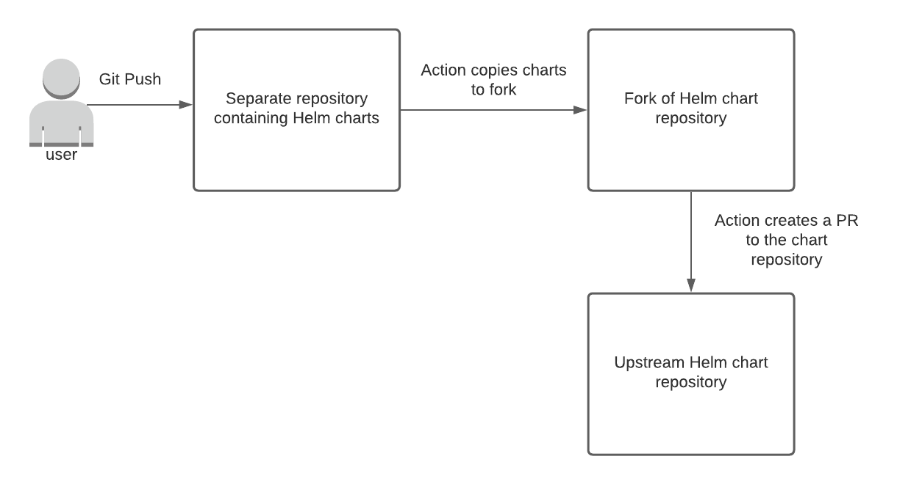

# chart-repo-pr-action
This action is used to copy Helm charts to a central Helm chart repository by automatically submitting a PR. The below diagram depicts the intended usage of this Action.



## Who Is This Action For?
You might be interested in this Action if you:
* Maintain at least one Helm chart in your own git repository
* Would like to publish your chart(s) to a central chart repository
* Would _not_ like to move your Helm charts out of your repository

This action allows you to sync Helm charts you maintain in your own repository to a central chart repository without requiring you to move or copy your Helm charts manually. It does this by making a PR to the chart repository in an automated and idempotent fashion.

Interested? Read on to learn how to use this Action.

## Prerequisites
In order to use this action, you need to have the following items:
* A repository (referred to as the `local` repo) containing Helm charts you'd like to copy to a chart repository (referred to as the `central` repo)
* A personal access token. See [The auth_token Parameter](#the-auth_token-parameter) section of this doc for more information.
* (Optional) A fork of the central Helm chart repository. This is required if the central chart repo belongs to a different org and you don't have permission to push directly.

## Basic Usage
Below shows the basic usage to include this Action in your workflow. This action is to be used in your local repo containing the Helm charts you'd like to copy.
```yaml
name: Submit PR to chart repository
on:
  push:
    branches:
      - master

jobs:
  test-job:
    runs-on: ubuntu-latest
    steps:
      - uses: actions/checkout@v2
      - uses: deweya/chart-repo-pr-action@v0.2.0
        with:
          auth_token: ${{ secrets.PAT }}
          chart_repo: deweya0/helm-charts
          committer_email: deweya964@gmail.com
```

Alternatively, if you do not have permission to push directly to `chart_repo`, be sure to provide the `fork_owner` parameter as well so the Action can push directly to your fork instead:

```yaml
name: Submit PR to chart repository
on:
  push:
    branches:
      - master

jobs:
  test-job:
    runs-on: ubuntu-latest
    steps:
      - uses: actions/checkout@v2
      - uses: deweya/chart-repo-pr-action@v0.2.0
        with:
          auth_token: ${{ secrets.PAT }}
          chart_repo: deweya0/helm-charts
          fork_owner: deweya
          committer_email: deweya964@gmail.com
```

The `auth_token` and `chart_repo` parameters are required. The `committer_email` parameter is optional, but is recommended.

See the next section for additional parameters.

## Parameters
| Parameter | Description | Default | Required? |
| --------- | ----------- | ------- | --------- |
| `auth_token` | Token used for authentication to push | - | true |
| `chart_repo` | The central chart repository that you want to publish your charts to (ex: deweya0/helm-charts) | - | true |
| `fork_owner` | The owner of the chart repo fork (ex: deweya). If blank, this Action assumes that you are publishing to a chart repo with the same org as your local repository. | - | false |
| `auth_user` | Username used for authentication to push. | Defaults to the user who triggered the action | false |
| `local_charts_dir` | Charts directory name in local repo | `charts` | false |
| `central_charts_dir` | Charts directory name in central repo | `charts` | false |
| `head_branch` | New or existing branch the action should use as the PR head branch | `feat/sync` | false |
| `base_branch` | Existing chart repo branch that the action should use as the PR base branch | `master` | false |
| `committer_name` | The GitHub username to use as the committer name. | Default to the user who triggered the action | false |
| `committer_email` | The email to use as the committer email | `<>` | false |
| `commit_message` | Commit message to use for push | `Syncing local charts with central chart repo` | false |

### The `auth_token` Parameter
This parameter requires special attention. It is used to authenticate so that the action can push.

It is recommended to create a `Personal Access Token` (or `PAT`). [This doc](https://docs.github.com/en/free-pro-team@latest/github/authenticating-to-github/creating-a-personal-access-token#creating-a-token) describes how you can create a PAT.

**NOTE:** Be sure to grant your PAT the following permissions at a minimum:
* public_repo
* read:discussion

Once you have created your PAT, you should create a secret in your repository containing your Helm chart(s). [This doc](https://docs.github.com/en/free-pro-team@latest/actions/reference/encrypted-secrets#creating-encrypted-secrets-for-a-repository) describes how you can create a secret.

Once you have created a secret, you can refer to it in your workflow like this:
```yaml
auth_token: ${{ secrets.PAT }}
```

Of course, be sure to use a different name other than `PAT` if you gave your secret a different name.

### The `head_branch` Parameter
One important thing to call out about the `head_branch` parameter is that this action will make a **force push** against this branch. As a result, it is highly recommended that you select a dedicated `head_branch` for this action or use the default `feat/sync` branch. If you attempt to make changes to `head_branch`, they may be wiped out when this action runs.

The force push is necessary because this action synchronizes your `head_branch` with the central chart repo's `base_branch` in order to produce an accurate diff. Since it is possible that this will rewrite `head_branch`'s history, this action performs a force push.